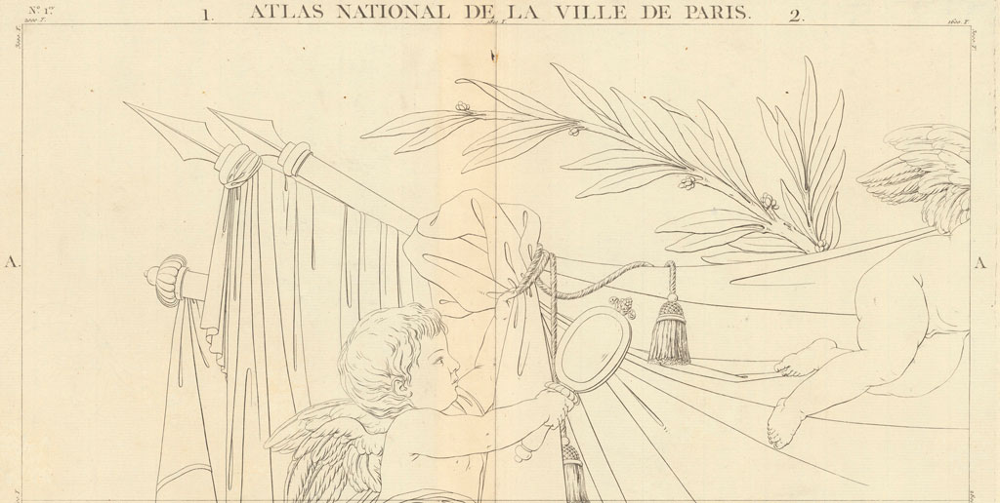
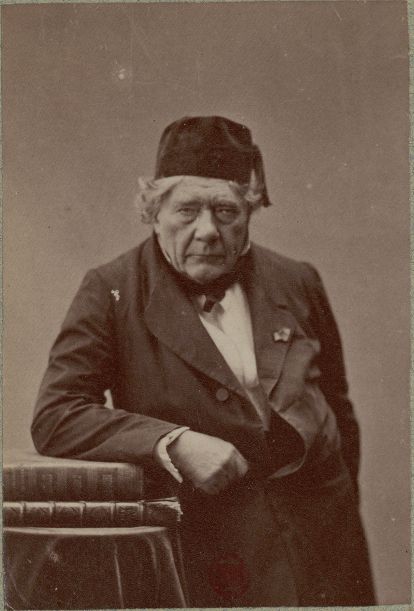

# Verniquet Edmé : Atlas Du Plan General De La Ville Paris.

* *Environment : #!/bin/bash*
* *Requirement : **gdal exiftool awk***
* Toises vers mètres EPSG:27561 --> EPSG:3857 (ou Google 900913)

# AN IV de la République

Usage: Verniquet2metters/Start.sh

Conventions / noms de fichiers : Planche-[numèro_de_Planche]_Edme_Verniquet.tif

exemple: Planche-35_Edme_Verniquet.tif

Georeferencement unité source : toises

Origine : pilier géodésique de l'Observatoire de Paris.

1 toise = 1.949036310 mètre

1 pied = 0.32483938500000000000 mètre

Position théorique du pilier géodésique en Lamber Nord EPSG:27561:

Soit 2 toises et 5 pieds au sud du centre du puits. Ou: 17 pieds

Soit 5.84710893000000000000 toises (décimales) au sud du centre du puits

Soit encore en (mètres) : 16.566808635 m au sud du centre du puits

Centre du puits Lambert Nord EPSG:27561 : Est 600000 Nord 126224 unité / mètres

Pilier géodésique Lambert Nord EPSG:27561 : Est 600000 Nord 126207.433191365 unité / mètres

Destination depuis Nouvelle Triangulation Francaise (Paris) EPSG:27561 vers (mètres) EPSG:3857

Petit clin d'oeil à mon ancètre Jacques Babinet, ici photographié par Nadar vers 1860 :
[Jacques Babinet](https://fr.wikipedia.org/wiki/Jacques_Babinet)    
