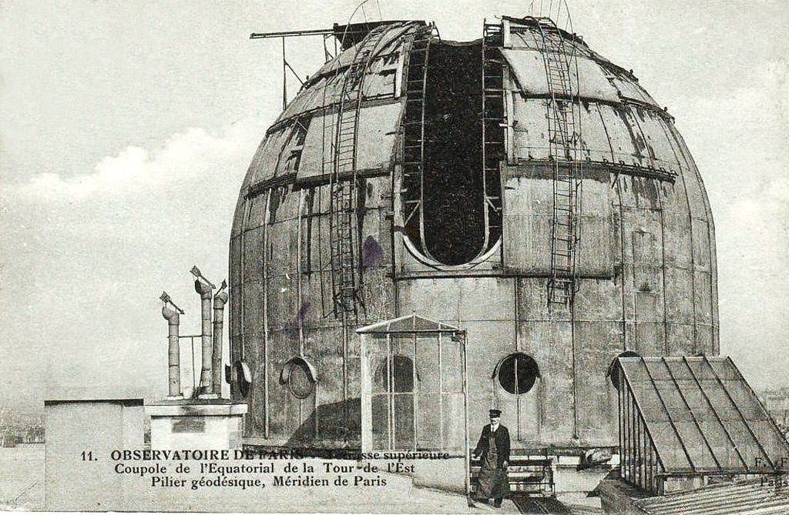

# verniquet
Georeferencement toises

Base : pilier géodésique de l'Observatoire de Paris.
1 toise = 1.949036310 mètre
pied = 0.32483938500000000000 mètre
Position théorique / Lamber Nord EPSG:27561:

Soit 2 toises et 5 pièds au sud du puits. Ou: 18 pieds

Soit 5.84710893000000000000 au sud du puits

Puits Lambert Nord EPSG:27561 : Est 600000 Nord 126224
Est 600000 Nord 126218.15289107 unité / mètres

